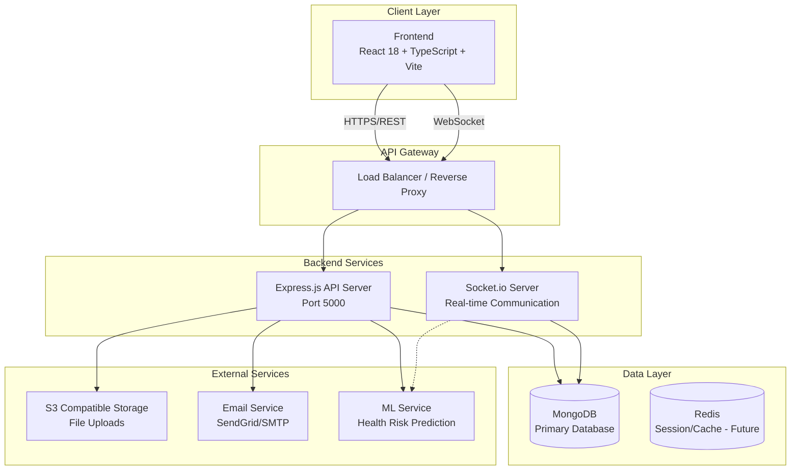
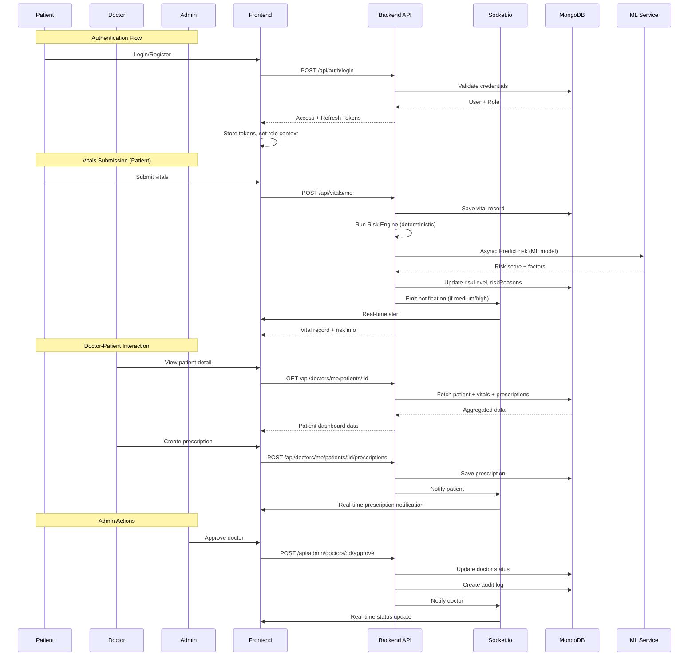
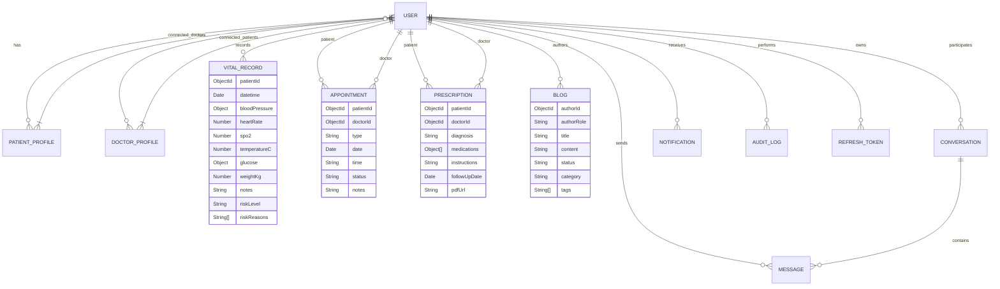
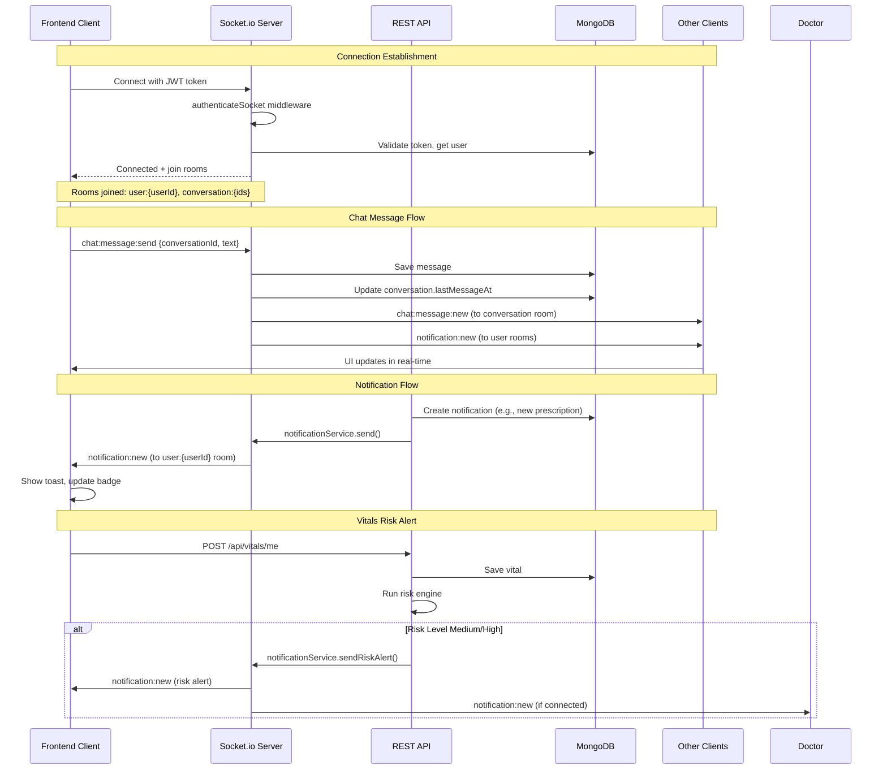
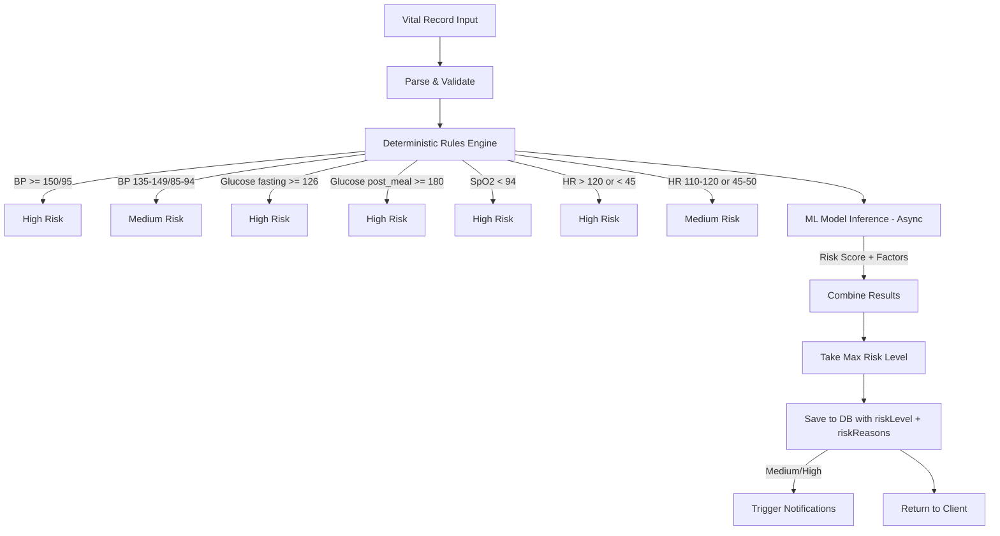
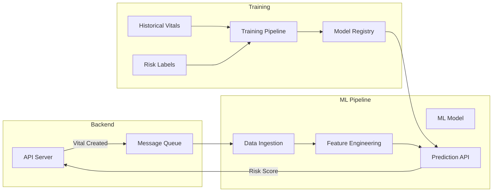
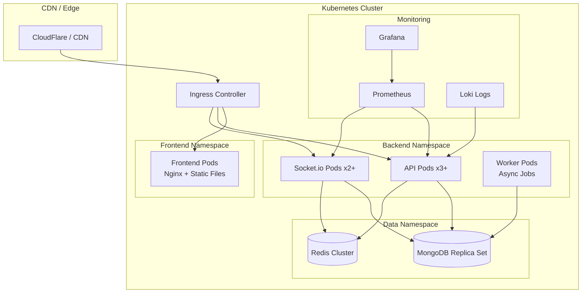
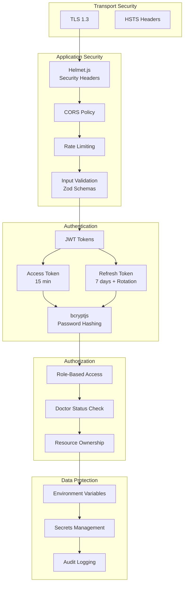

# HealthMonitor Pro - System Architecture

## Overview

HealthMonitor Pro is a three-role health monitoring platform (Patient, Doctor, Admin) with real-time capabilities built on a modern Node.js/React stack.



## High-Level Data Flow



## Role-Based Access Control

```mermaid
graph TD
    subgraph "Authentication"
        Login[Login / Register]
        JWT[JWT Token Generation]
        Roles[Role Assignment]
    end

    subgraph "Authorization Middleware"
        Verify[Verify Token]
        CheckRole[Check Role]
        CheckStatus[Check Doctor Status]
    end

    subgraph "Patient Routes"
        P1[/patient/dashboard]
        P2[/patient/vitals]
        P3[/patient/trends]
        P4[/patient/doctors]
        P5[/patient/appointments]
        P6[/patient/prescriptions]
        P7[/patient/messages]
        P8[/patient/profile]
    end

    subgraph "Doctor Routes"
        D1[/doctor/dashboard]
        D2[/doctor/patients]
        D3[/doctor/patients/:id]
        D4[/doctor/prescriptions]
        D5[/doctor/appointments]
        D6[/doctor/blogs]
        D7[/doctor/messages]
        D8[/doctor/profile]
        D9[/doctor/pending-approval]
        D10[/doctor/onboarding]
    end

    subgraph "Admin Routes"
        A1[/admin/dashboard]
        A2[/admin/doctors]
        A3[/admin/patients]
        A4[/admin/blogs]
        A5[/admin/analytics]
        A6[/admin/notifications]
        A7[/admin/settings]
    end

    Login --> JWT --> Roles
    Roles --> Verify --> CheckRole
    CheckRole -->|patient| CheckStatus
    CheckRole -->|doctor| CheckStatus
    CheckRole -->|admin| A1
    CheckStatus -->|approved| P1 & P2 & P3 & P4 & P5 & P6 & P7 & P8
    CheckStatus -->|approved| D1 & D2 & D3 & D4 & D5 & D6 & D7 & D8
    CheckStatus -->|pending| D9
    CheckStatus -->|onboarding| D10
    CheckStatus -->|rejected/suspended| D9
```

## Database Schema Relationships



## API Module Architecture

```mermaid
graph TB
    subgraph "Express App"
        Server[server.js]
    end

    subgraph "Route Modules"
        AuthRoutes[/api/auth]
        PatientRoutes[/api/patients]
        DoctorRoutes[/api/doctors]
        VitalRoutes[/api/vitals]
        BlogRoutes[/api/blogs]
        AdminRoutes[/api/admin]
        ChatRoutes[/api/chat]
        ApptRoutes[/api/appointments]
        RxRoutes[/api/prescriptions]
        NotifRoutes[/api/notifications]
    end

    subgraph "Controller Layer"
        AuthCtrl[authController]
        PatientCtrl[patientController]
        DoctorCtrl[doctorController]
        VitalCtrl[vitalController]
        BlogCtrl[blogController]
        AdminCtrl[adminController]
        ChatCtrl[chatController]
        ApptCtrl[appointmentController]
        RxCtrl[prescriptionController]
        NotifCtrl[notificationController]
    end

    subgraph "Service Layer"
        AuthSvc[authService]
        RiskEngine[riskEngine]
        NotifSvc[notificationService]
        EmailSvc[emailService]
        AuditSvc[auditService]
        PdfSvc[pdfService]
        S3Svc[s3Service]
    end

    subgraph "Middleware"
        VerifyToken[verifyToken]
        CheckRole[checkRole]
        RequireDocApproved[requireDoctorApproved]
        Validate[validate]
        RateLimit[rateLimiter]
        ErrorHandler[errorHandler]
    end

    subgraph "Socket Layer"
        AuthSocket[authenticateSocket]
        ChatHandler[chatHandler]
        NotifHandler[notificationHandler]
    end

    Server --> AuthRoutes
    Server --> PatientRoutes
    Server --> DoctorRoutes
    Server --> VitalRoutes
    Server --> BlogRoutes
    Server --> AdminRoutes
    Server --> ChatRoutes
    Server --> ApptRoutes
    Server --> RxRoutes
    Server --> NotifRoutes

    AuthRoutes --> AuthCtrl
    PatientRoutes --> PatientCtrl
    DoctorRoutes --> DoctorCtrl
    VitalRoutes --> VitalCtrl
    BlogRoutes --> BlogCtrl
    AdminRoutes --> AdminCtrl
    ChatRoutes --> ChatCtrl
    ApptRoutes --> ApptCtrl
    RxRoutes --> RxCtrl
    NotifRoutes --> NotifCtrl

    AuthCtrl --> AuthSvc
    VitalCtrl --> RiskEngine
    VitalCtrl --> NotifSvc
    PatientCtrl --> NotifSvc
    DoctorCtrl --> NotifSvc
    AdminCtrl --> AuditSvc
    RxCtrl --> PdfSvc
    BlogCtrl --> S3Svc
    ChatCtrl --> NotifSvc

    AuthRoutes --> VerifyToken
    PatientRoutes --> VerifyToken
    PatientRoutes --> CheckRole
    DoctorRoutes --> VerifyToken
    DoctorRoutes --> CheckRole
    DoctorRoutes --> RequireDocApproved
    AdminRoutes --> VerifyToken
    AdminRoutes --> CheckRole
    AllRoutes --> Validate
    AuthRoutes --> RateLimit
    Server --> ErrorHandler

    Server --> AuthSocket
    AuthSocket --> ChatHandler
    AuthSocket --> NotifHandler
```

## Real-time Communication Flow



## Frontend Route Architecture

```mermaid
graph TD
    App[App.tsx] --> Router[AppRouter.tsx]
    Router --> GuestOnly[GuestOnly Wrapper]
    Router --> RequireAuth[RequireAuth Wrapper]

    GuestOnly --> PublicRoutes[Public Routes]
    PublicRoutes --> Home[/]
    PublicRoutes --> Doctors[/doctors]
    PublicRoutes --> DoctorDetail[/doctors/:id]
    PublicRoutes --> Blogs[/blogs]
    PublicRoutes --> Login[/login]
    PublicRoutes --> AdminLogin[/admin/login]
    PublicRoutes --> Register[/register]

    RequireAuth -->|role: patient| PatientLayout[PatientLayout]
    PatientLayout --> PDash[/patient/dashboard]
    PatientLayout --> PVitals[/patient/vitals]
    PatientLayout --> PTrends[/patient/trends]
    PatientLayout --> PDocs[/patient/doctors]
    PatientLayout --> PAppts[/patient/appointments]
    PatientLayout --> PRx[/patient/prescriptions]
    PatientLayout --> PMsgs[/patient/messages]
    PatientLayout --> PNotif[/patient/notifications]
    PatientLayout --> PProfile[/patient/profile]

    RequireAuth -->|role: doctor| DoctorLayout[DoctorLayout]
    DoctorLayout --> DDash[/doctor/dashboard]
    DoctorLayout --> DPatients[/doctor/patients]
    DoctorLayout --> DPatientDetail[/doctor/patients/:id]
    DoctorLayout --> DRx[/doctor/prescriptions]
    DoctorLayout --> DAppts[/doctor/appointments]
    DoctorLayout --> DBlogs[/doctor/blogs]
    DoctorLayout --> DMsgs[/doctor/messages]
    DoctorLayout --> DProfile[/doctor/profile]
    DoctorLayout --> DOnboard[/doctor/onboarding]
    DoctorLayout --> DPending[/doctor/pending-approval]

    RequireAuth -->|role: admin| AdminLayout[AdminLayout]
    AdminLayout --> ADash[/admin/dashboard]
    AdminLayout --> ADoctors[/admin/doctors]
    AdminLayout --> APatients[/admin/patients]
    AdminLayout --> ABlogs[/admin/blogs]
    AdminLayout --> AAppts[/admin/appointments]
    AdminLayout --> AAnalytics[/admin/analytics]
    AdminLayout --> ANotif[/admin/notifications]
    AdminLayout --> ASettings[/admin/settings]
```

## Risk Engine Pipeline



## ML Service Integration (Planned)



## Deployment Architecture (Production)



## Security Architecture



## Key Design Decisions

| Area | Decision | Rationale |
|------|----------|-----------|
| **Auth** | JWT with refresh rotation | Stateless, scalable, secure token lifecycle |
| **Real-time** | Socket.io with rooms | Reliable fallback, auto-reconnection, room-based broadcasting |
| **Database** | MongoDB + Mongoose | Flexible schema for varied health data, rich querying |
| **Validation** | Zod | TypeScript-first, runtime + compile-time safety |
| **Risk Engine** | Deterministic + ML hybrid | Immediate rules for safety, ML for nuance |
| **File Storage** | S3-compatible | Scalable, decoupled from compute |
| **Error Handling** | Centralized middleware | Consistent error responses, proper logging |
| **Audit** | Immutable logs | Compliance, debugging, accountability |

## Scalability Considerations

1. **Horizontal Scaling**: Stateless API pods behind load balancer
2. **Socket.io Scaling**: Redis adapter for multi-node WebSocket support
3. **Database**: MongoDB replica set with read replicas for analytics
4. **Caching**: Redis for sessions, rate limits, frequent queries
5. **Async Processing**: Worker queue for ML inference, PDF generation, emails
6. **CDN**: Static assets served via CDN with cache headers