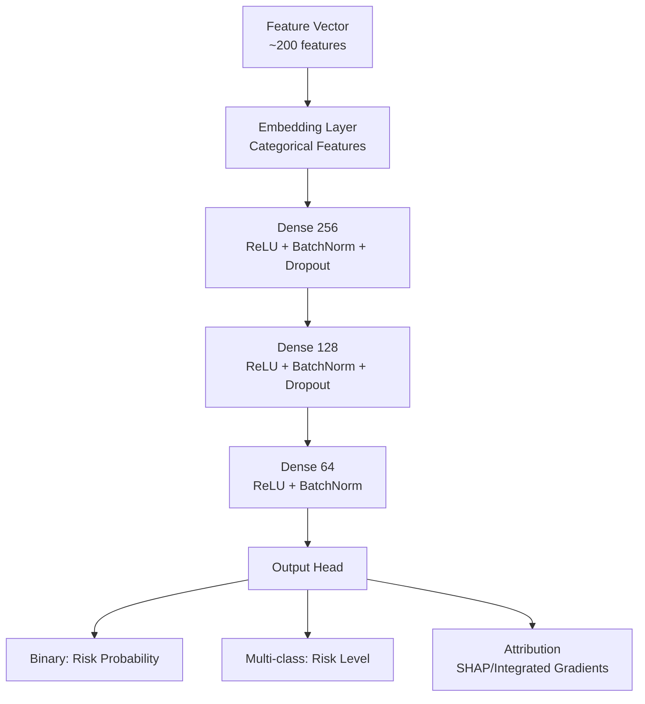
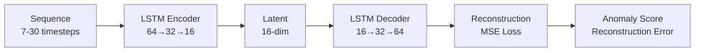
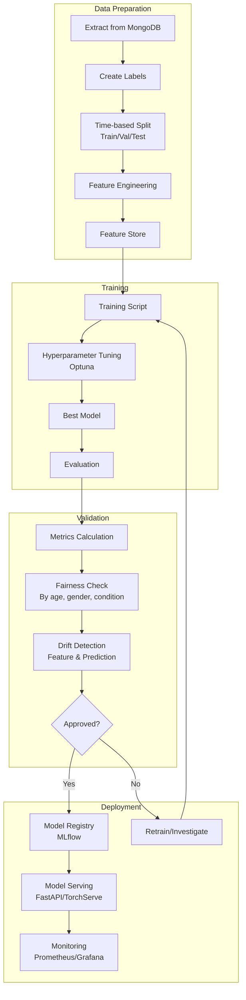
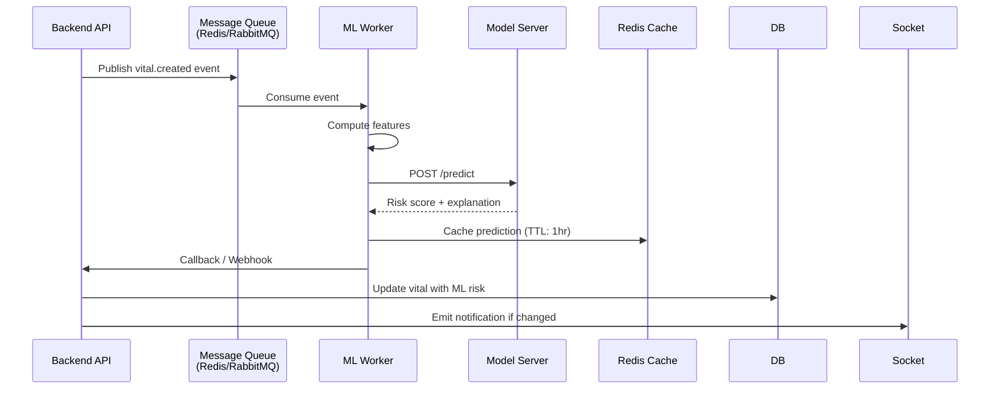

# HealthMonitor Pro - ML Model Specification

## Overview

This document specifies the machine learning models and pipeline for enhancing HealthMonitor Pro with predictive health monitoring capabilities. The ML system will complement the existing deterministic risk engine with data-driven predictions.

---

## Problem Statement

### Current State (Deterministic Rules)
The backend currently uses a rule-based risk engine (`backend/src/services/riskEngine.js`) that evaluates vitals against fixed thresholds:
- Blood pressure, glucose, SpO2, heart rate thresholds
- Immediate, explainable, but static
- Cannot capture individual baselines, trends, or complex interactions

### Desired State (Hybrid: Deterministic + ML)
- **Deterministic**: Safety-critical immediate thresholds (always run)
- **ML**: Personalized risk scoring, anomaly detection, trend prediction
- **Combined**: Max of both systems, with ML providing early warning

---

## ML Use Cases

### 1. Health Risk Prediction (Primary)
**Objective**: Predict 7-day risk of adverse health event (ER visit, hospitalization, significant vital deterioration)

**Target**: Binary classification (high risk / normal) or multi-class (low/medium/high/critical)

**Features**:
- Current vital readings (BP, HR, SpO2, temp, glucose, weight)
- Historical trends (7-day, 30-day rolling statistics)
- Rate of change (derivatives)
- Patient demographics (age, gender, conditions)
- Comorbidities from medical history
- Medication adherence signals
- Seasonal/time features

**Output**: Risk score (0-1), risk level, contributing factors

### 2. Vital Anomaly Detection
**Objective**: Detect unusual vital patterns for individual patients

**Approach**: Unsupervised / semi-supervised
- Personalized baseline per patient
- Statistical process control (CUSUM, EWMA)
- Isolation Forest / Autoencoder for multivariate anomalies
- Context-aware (time of day, activity, medication timing)

**Output**: Anomaly score, affected vitals, severity

### 3. Trend Forecasting
**Objective**: Forecast vital trajectories 1-7 days ahead

**Approach**: Time-series forecasting
- Prophet / NeuralProphet for interpretability
- LSTM / Temporal Fusion Transformer for accuracy
- Per-vital or multivariate

**Output**: Predicted values + confidence intervals

### 4. Personalized Recommendations
**Objective**: Recommend actions, content, or provider matches

**Types**:
- Health article recommendations (content-based + collaborative)
- Doctor matching (specialization, availability, patient similarity)
- Lifestyle nudges (based on vital patterns)
- Appointment scheduling optimization

---

## Data Sources

### Primary Training Data
| Source | Collection | Key Fields |
|--------|------------|------------|
| Vitals | `vitalRecords` | All vital fields + riskLevel + riskReasons + timestamps |
| Users | `users` + `patientProfiles` | Demographics, medical history, medications, allergies |
| Appointments | `appointments` | Frequency, types, outcomes, no-shows |
| Prescriptions | `prescriptions` | Medications, adherence proxies |
| Outcomes | Future: Lab results, ER visits, hospitalizations | Labels for supervised learning |

### Feature Engineering Pipeline

```mermaid
flowchart LR
    Raw[Raw Vitals] --> Clean[Clean & Impute]
    Clean --> Align[Temporal Alignment]
    Align --> Window[Rolling Windows<br/>1d, 7d, 30d]
    Window --> Stats[Aggregations<br/>mean, std, min, max, slope]
    Stats --> Deriv[Derivatives<br/>rate of change]
    Deriv --> Demo[Join Demographics]
    Demo --> Medical[Join Medical History]
    Medical --> Meds[Join Medications]
    Meds --> Encode[Encode Categoricals]
    Encode --> Scale[Scale/Normalize]
    Scale --> Features[Feature Vector]
```



### Feature Categories

#### Vital Features (per vital sign)
- Current value
- Rolling mean (7d, 30d)
- Rolling std (7d, 30d)
- Rolling min/max (7d, 30d)
- Slope/trend (linear regression over 7d, 30d)
- Rate of change (diff from previous)
- Deviation from personal baseline
- Time since last reading
- Reading frequency consistency

#### Cross-Vital Features
- BP pulse pressure (systolic - diastolic)
- BP mean arterial pressure
- HR × BP interaction
- SpO2 × HR interaction
- Glucose variability (if multiple readings)

#### Demographic Features
- Age (binned)
- Gender
- BMI (calculated from height/weight)
- Blood group

#### Clinical Features
- Comorbidity count (from medicalHistory)
- Specific conditions (diabetes, hypertension, cardiac, respiratory)
- Medication count
- Specific drug classes (ACE inhibitors, beta blockers, insulin, etc.)
- Allergy count

#### Temporal Features
- Hour of day (cyclical encoding)
- Day of week
- Month/season
- Days since last appointment
- Days since last prescription

#### Engagement Features
- Appointment adherence rate
- Vitals logging frequency
- Message response time
- Blog/article engagement

---

## Model Architecture

### Risk Prediction Model



**Specifications**:
- Framework: PyTorch / TensorFlow/Keras
- Input: 200-300 features per sample
- Output: Probability distribution over risk levels
- Loss: Focal loss (class imbalance) + calibration loss
- Optimization: AdamW, cosine annealing LR
- Regularization: Dropout (0.3), weight decay (1e-4), label smoothing

### Anomaly Detection Model

**Option A: Isolation Forest (Baseline)**
- Fast training, interpretable
- Per-patient or global with patient ID feature
- Contamination parameter: 0.01-0.05

**Option B: LSTM Autoencoder (Advanced)**

- Trained on normal sequences only
- Threshold: 95th/99th percentile of training reconstruction error

### Trend Forecasting Model

**Option A: Prophet (Interpretable Baseline)**
- Handles seasonality, holidays, missing data
- Per-vital univariate
- Uncertainty intervals via MCMC

**Option B: Temporal Fusion Transformer (SOTA)**
- Multi-horizon (1d, 3d, 7d)
- Static covariates (demographics) + time-varying (vitals)
- Variable selection gates for interpretability
- Quantile outputs for prediction intervals

---

## Training Pipeline



### Label Creation Strategy

**Risk Prediction Labels** (requires outcome data):
```
Positive (High Risk): 
  - ER visit within 7 days
  - Hospitalization within 7 days  
  - Vital deterioration triggering clinical intervention
  - Doctor-flagged high concern

Negative (Normal):
  - No adverse events in 30 days
  - Routine follow-up only
```

**Current Workaround** (until outcome data available):
- Use deterministic risk engine labels as weak supervision
- `riskLevel = high` → positive (with noise)
- `riskLevel = normal` → negative
- Semi-supervised / noisy label learning techniques

---

## Model Serving Architecture



### API Contract (ML Service)

**Request**
```json
POST /predict/risk
{
  "patientId": "ObjectId",
  "vitalId": "ObjectId",
  "features": {
    "vitals_current": {...},
    "vitals_rolling_7d": {...},
    "vitals_rolling_30d": {...},
    "demographics": {...},
    "clinical": {...},
    "temporal": {...}
  },
  "requestId": "uuid"
}
```

**Response**
```json
{
  "requestId": "uuid",
  "patientId": "ObjectId",
  "riskScore": 0.73,
  "riskLevel": "high",
  "confidence": 0.89,
  "contributingFactors": [
    {"feature": "systolic_bp_7d_slope", "value": 2.3, "impact": 0.31},
    {"feature": "glucose_30d_std", "value": 45.2, "impact": 0.24},
    {"feature": "hr_deviation_from_baseline", "value": 18, "impact": 0.18}
  ],
  "modelVersion": "risk-v2.1.0",
  "inferenceTimeMs": 12
}
```

---

## Integration with Backend

### Current Risk Engine Enhancement

```javascript
// backend/src/services/riskEngine.js - Enhanced
async function evaluateVitalRisk(vital) {
  // 1. Deterministic rules (always run, fast)
  const deterministic = evaluateDeterministic(vital);
  
  // 2. Async ML prediction (non-blocking)
  mlPredictRisk(vital.patientId, vital._id)
    .then(mlResult => {
      // Combine: take max risk level
      const combined = combineRisk(deterministic, mlResult);
      // Update DB with combined result
      updateVitalRisk(vital._id, combined);
      // Notify if ML upgraded risk
      if (mlResult.riskLevel > deterministic.riskLevel) {
        notifyRiskUpgrade(vital.patientId, combined);
      }
    })
    .catch(err => {
      logger.warn('ML prediction failed, using deterministic only', err);
    });
  
  // 3. Return deterministic immediately for response
  return deterministic;
}
```

### Feature Computation Service

```javascript
// backend/src/services/mlFeatureService.js
async function computeFeatures(patientId, vitalId, windowDays = 30) {
  const vitals = await VitalRecord.find({
    patientId,
    datetime: { $gte: new Date(Date.now() - windowDays * 864e5) }
  }).sort({ datetime: 1 }).lean();
  
  const patient = await User.findById(patientId).lean();
  const profile = await PatientProfile.findOne({ userId: patientId }).lean();
  const appointments = await Appointment.find({ patientId }).lean();
  const prescriptions = await Prescription.find({ patientId }).lean();
  
  return buildFeatureVector(vitals, patient, profile, appointments, prescriptions);
}
```

### Message Queue Setup

```javascript
// backend/src/services/queueService.js
const { createClient } = require('redis');
const queue = createClient({ url: process.env.REDIS_URL });

// Producer (in vitalController after save)
await queue.lPush('ml:vital:predict', JSON.stringify({
  patientId: vital.patientId,
  vitalId: vital._id,
  timestamp: new Date()
}));

// Consumer (separate worker process)
for await (const msg of queue.lPop('ml:vital:predict')) {
  const { patientId, vitalId } = JSON.parse(msg);
  await mlWorker.process(patientId, vitalId);
}
```

---

## Model Evaluation

### Metrics

| Model | Primary Metric | Secondary Metrics |
|-------|----------------|-------------------|
| Risk Prediction | AUROC, AUPRC | Sensitivity@90%Spec, Brier Score, Calibration |
| Anomaly Detection | F1@optimal_threshold | Precision@k, Recall@k, Time-to-detect |
| Trend Forecasting | MAE, RMSE | Coverage of prediction intervals, CRPS |
| Recommendations | NDCG@10, Recall@10 | Diversity, Novelty, Serendipity |

### Validation Strategy
- **Temporal splits**: Train on older data, validate on newer (no leakage)
- **Patient-level splits**: No patient in both train and test
- **Stratification**: By risk level, condition, demographics
- **Cross-validation**: Time-series CV (expanding window)

### Fairness Checks
- Equalized odds across: age groups, gender, ethnicity (if available), primary condition
- Demographic parity in risk predictions
- Calibration curves per subgroup

---

## Monitoring & Observability

### Model Metrics (Prometheus)
```prometheus
# Inference latency
ml_inference_duration_seconds{model="risk",quantile="0.95"}

# Prediction distribution
ml_risk_score_distribution{model="risk",level="high"}

# Feature drift
ml_feature_drift_score{model="risk",feature="systolic_bp_mean_7d"}

# Prediction drift
ml_prediction_drift{model="risk",metric="psi"}

# Data quality
ml_missing_feature_rate{model="risk",feature="glucose_value"}

# Business metrics
ml_risk_upgrade_count{model="risk"}  # ML upgraded deterministic
ml_false_alert_rate{model="risk"}    # Doctor dismissed
```

### Alerting Rules
- Inference latency p99 > 500ms
- Feature drift PSI > 0.2 for any feature
- Prediction distribution shift > 10%
- Model version not updated in 30 days
- Error rate > 1%

### Retraining Triggers
- Scheduled: Weekly (if new data > 1000 samples)
- Drift-detected: Feature or prediction drift
- Performance: AUROC drop > 0.02 on shadow evaluation
- Manual: New feature, label correction, regulatory change

---

## Infrastructure Requirements

### Compute
| Component | Specification |
|-----------|---------------|
| Training | 1x GPU (T4/V100) or 8-16 CPU cores, 32-64GB RAM |
| Inference | CPU-optimized (ONNX Runtime), 2-4 cores, 4-8GB RAM per replica |
| Feature Store | Redis (hot) + PostgreSQL/Parquet (cold) |
| Model Registry | MLflow + S3 artifact store |
| Message Queue | Redis Streams / RabbitMQ |

### Storage
- Training data: ~10GB/month (compressed Parquet)
- Model artifacts: ~500MB per version
- Feature store: ~5GB (hot features)

### MLOps Stack
- **Orchestration**: Airflow / Prefect / Dagster
- **Experiment Tracking**: MLflow
- **Model Registry**: MLflow Model Registry
- **Serving**: FastAPI + ONNX Runtime / TorchServe / Triton
- **Monitoring**: Prometheus + Grafana + Evidently AI
- **CI/CD**: GitHub Actions + ArgoCD / Flux

---

## Implementation Roadmap

### Phase 7.1: Foundation (Week 1-2)
- [ ] Set up Python ML service repository
- [ ] Configure MLflow tracking server
- [ ] Build feature engineering library
- [ ] Create training data extraction scripts
- [ ] Implement baseline Isolation Forest anomaly detection

### Phase 7.2: Risk Prediction Model (Week 3-5)
- [ ] Create labels from deterministic engine (weak supervision)
- [ ] Train XGBoost/LightGBM baseline
- [ ] Implement SHAP explanations
- [ ] Build evaluation dashboard
- [ ] A/B test framework

### Phase 7.3: Anomaly Detection (Week 5-6)
- [ ] Train per-patient Isolation Forest
- [ ] Evaluate on historical anomalies
- [ ] Integrate with notification system

### Phase 7.4: Trend Forecasting (Week 6-7)
- [ ] Implement Prophet baseline per vital
- [ ] Build forecast API
- [ ] Frontend integration for trend charts

### Phase 7.5: Integration & Hardening (Week 8-9)
- [ ] Async inference via message queue
- [ ] Fallback to deterministic rules
- [ ] Monitoring dashboards
- [ ] Load testing
- [ ] Documentation & runbooks

### Phase 7.6: Advanced Models (Week 10+)
- [ ] Deep learning risk model (TabNet/FT-Transformer)
- [ ] LSTM Autoencoder for anomalies
- [ ] Temporal Fusion Transformer for forecasting
- [ ] Recommendation models

---

## Risk Mitigation

| Risk | Mitigation |
|------|------------|
| No outcome labels | Weak supervision + semi-supervised learning; collect outcomes prospectively |
| Class imbalance | Focal loss, oversampling, threshold tuning |
| Concept drift | Continuous monitoring, automated retraining triggers |
| Inference latency | Model quantization (ONNX), batching, caching |
| Explainability | SHAP, feature attribution, deterministic fallback |
| Regulatory | Audit trail, model cards, bias documentation |
| Data privacy | Feature computation in backend, no PII to ML service |

---

## Model Cards (Template)

### Risk Prediction Model Card
```
Model Name: HealthRiskPredictor
Version: v2.1.0
Type: Gradient Boosted Trees (LightGBM)
Task: 7-day adverse event risk classification
Training Data: 2024-01 to 2024-11 (100k patients, 2M vital records)
Features: 247 (vitals, demographics, clinical, temporal)
Performance: AUROC=0.87, AUPRC=0.43, Sensitivity@90%Spec=0.68
Calibration: ECE=0.023
Fairness: Equalized odds diff < 0.05 across age/gender/condition
Limitations: Weak labels, no ER/hospitalization ground truth
Intended Use: Clinical decision support, not diagnostic
Ethical: No automated clinical decisions; always human-in-the-loop
```

---

## Appendix: Current Deterministic Rules Reference

```javascript
// From backend/src/services/riskEngine.js
function evaluateVitalRisk(vital) {
  const reasons = [];
  let riskLevel = 'normal';

  // Blood Pressure
  if (systolic >= 150 || diastolic >= 95) {
    riskLevel = 'high';
    reasons.push('Blood pressure is in high-risk range');
  } else if ((systolic >= 135 && systolic <= 149) || 
             (diastolic >= 85 && diastolic <= 94)) {
    if (riskLevel !== 'high') riskLevel = 'medium';
    reasons.push('Blood pressure is above normal range');
  }

  // Glucose
  if (glucoseMode === 'fasting' && glucoseValue >= 126) {
    riskLevel = 'high';
    reasons.push('Fasting glucose is in high-risk range');
  }
  if (glucoseMode === 'post_meal' && glucoseValue >= 180) {
    riskLevel = 'high';
    reasons.push('Post-meal glucose is in high-risk range');
  }

  // SpO2
  if (spo2 < 94) {
    riskLevel = 'high';
    reasons.push('SpO2 is below safe threshold');
  }

  // Heart Rate
  if (heartRate > 120 || heartRate < 45) {
    riskLevel = 'high';
    reasons.push('Heart rate is in high-risk range');
  } else if ((heartRate > 110 || heartRate < 50) && riskLevel !== 'high') {
    riskLevel = 'medium';
    reasons.push('Heart rate is outside normal range');
  }

  return { riskLevel, riskReasons: reasons };
}
```

---

## Next Steps

1. **Immediate**: Set up ML service repository and infrastructure
2. **Short-term**: Build feature pipeline and train baseline models
3. **Medium-term**: Integrate with backend via async queue
4. **Long-term**: Advanced models, continuous learning, federated learning

---

*Document Version: 1.0*  
*Last Updated: 2026-08-31*  
*Owner: ML Engineering Team*