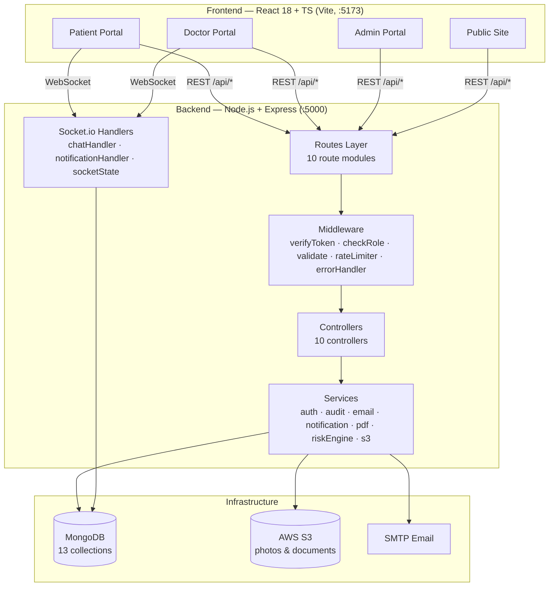
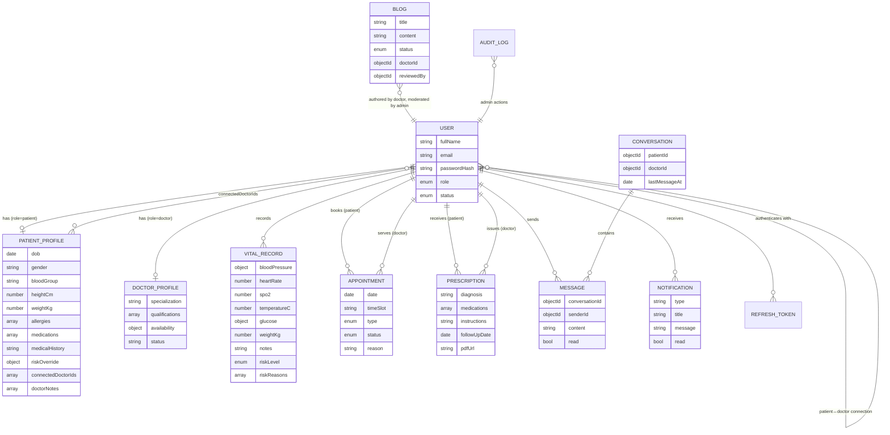
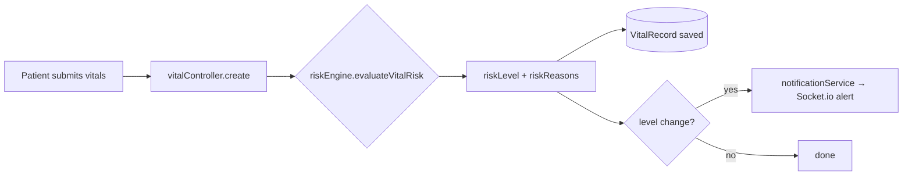
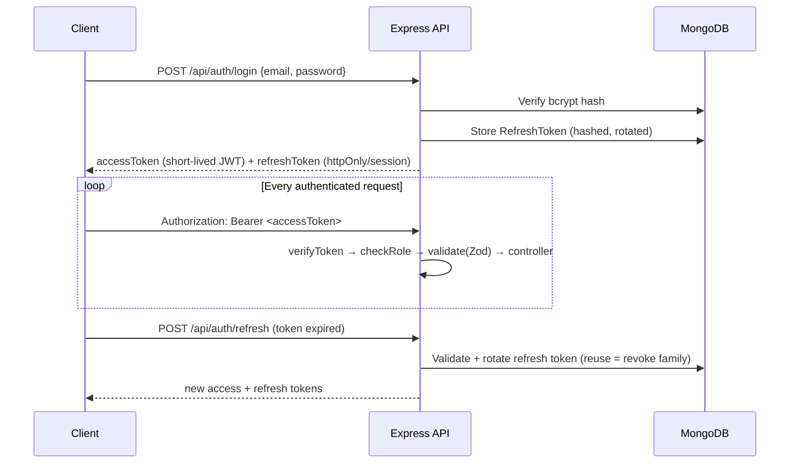
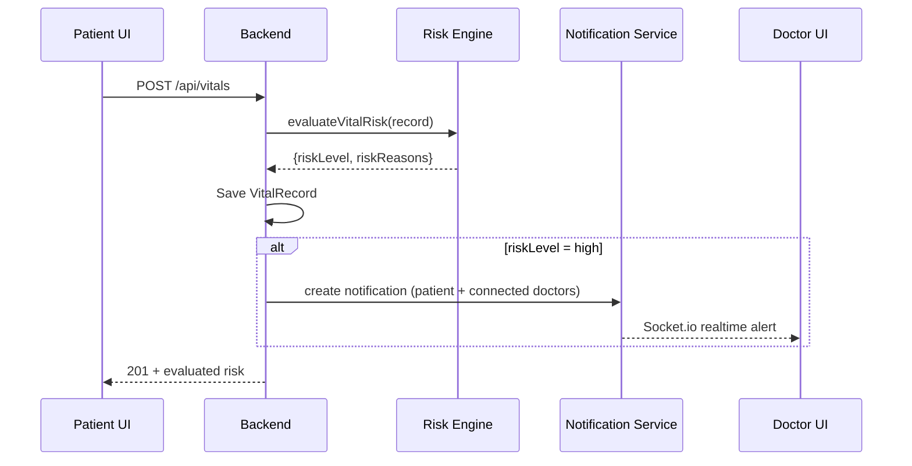
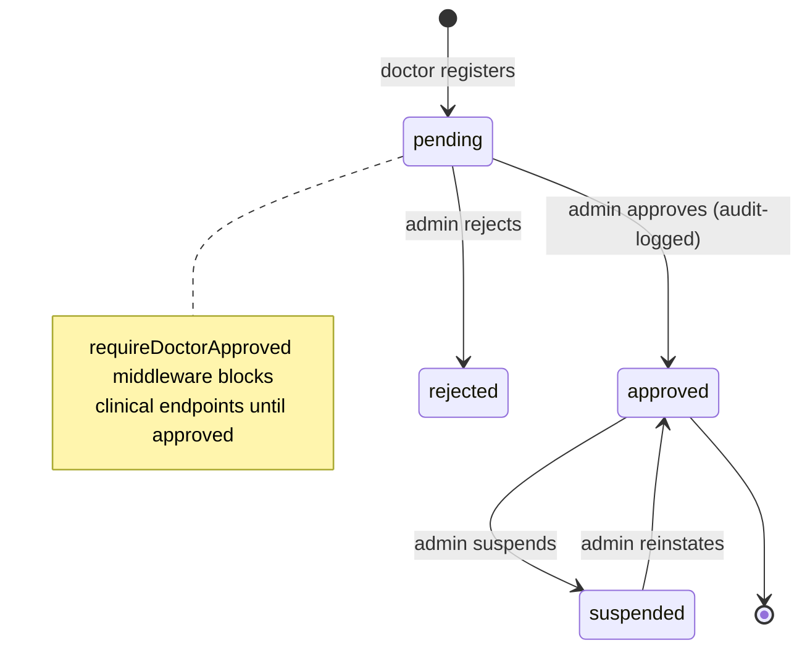
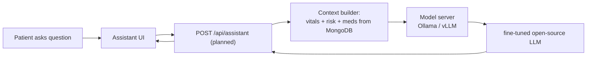

# HealthMonitor Pro — Complete Project Documentation

> Generated from the codebase-memory knowledge graph (1,796 nodes / 4,986 edges) + source analysis.
> Companion documents: [ARCHITECTURE.md](ARCHITECTURE.md), [API.md](API.md), [ML_MODEL.md](ML_MODEL.md), [LLM_TRAINING_DOCUMENTATION.md](LLM_TRAINING_DOCUMENTATION.md)

---

## 1. Project at a Glance

| Attribute | Value |
|---|---|
| **Product** | Health monitoring platform connecting Patients, Doctors, and Admins |
| **Core features** | Vitals tracking, risk assessment, appointments, teleconsultations, prescriptions (PDF), real-time chat, blog publishing with moderation, notifications, admin analytics |
| **Backend** | Node.js + Express.js, MongoDB (Mongoose), Socket.io, JWT (access + refresh rotation), Zod validation, Helmet/CORS/rate-limiting |
| **Frontend** | React 18 + TypeScript, Vite, React Router v6, Socket.io client, custom design system (CSS) |
| **Roles** | `patient`, `doctor`, `admin` (doctor approval workflow: pending → approved / rejected / suspended) |
| **Status** | Phases 0–6 complete. Classical-ML risk prediction planned ([ML_MODEL.md](ML_MODEL.md)); LLM health assistant planned ([LLM_TRAINING_DOCUMENTATION.md](LLM_TRAINING_DOCUMENTATION.md)) |

---

## 2. System Architecture



---

## 3. Repository Structure (annotated)

```
health-monitoring-dashboard/
├── backend/
│   ├── src/
│   │   ├── config/            # db.js, env.js, s3.js
│   │   ├── controllers/       # 10 controllers (one per domain)
│   │   │   ├── authController.js        # register patient/doctor, login, refresh, logout
│   │   │   ├── patientController.js     # profile, uploads, doctor connections
│   │   │   ├── doctorController.js      # profile, availability, patient records
│   │   │   ├── vitalController.js       # vitals CRUD + risk evaluation
│   │   │   ├── appointmentController.js # booking, confirm/complete/cancel
│   │   │   ├── prescriptionController.js# issue prescriptions + PDF
│   │   │   ├── chatController.js        # REST fallback for conversations
│   │   │   ├── blogController.js        # doctor articles + public blog
│   │   │   ├── adminController.js       # approvals, moderation, analytics
│   │   │   └── notificationController.js# unread counts, read markers
│   │   ├── middleware/        # verifyToken, checkRole, requireDoctorApproved,
│   │   │                      # validate (Zod), rateLimiter, errorHandler
│   │   ├── models/            # 13 Mongoose schemas (see §7)
│   │   ├── routes/            # 10 mounted route modules under /api/*
│   │   ├── schemas/           # 10 Zod request-validation schemas
│   │   ├── scripts/           # seedAdmin.js, seedReviews.js
│   │   ├── services/          # business logic (7 services)
│   │   ├── sockets/           # Socket.io: authenticateSocket, chatHandler,
│   │   │                      # notificationHandler, socketState
│   │   └── server.js          # entry point
│   ├── BACKEND_PHASES.md
│   ├── HealthMonitorPro_Phase0.postman_collection.json
│   └── .env.example
├── frontend/
│   ├── src/
│   │   ├── pages/
│   │   │   ├── admin/         # AdminDashboard, AdminDoctors, AdminBlogs, AdminAnalytics…
│   │   │   ├── doctor/        # DoctorDashboard, DoctorPatients, DoctorBlogs…
│   │   │   ├── patient/       # PatientDashboard, PatientVitals, PatientTrends…
│   │   │   └── public/        # HomePage, LoginPage, RegisterPage, BlogPage…
│   │   ├── routes/            # AppRouter.tsx, routePaths.ts (role-guarded)
│   │   ├── services/          # apiClient, authSession, sessionStore,
│   │   │                      # patient/doctor/adminPortalService, patientRealtime,
│   │   │                      # profilePhotoEvents, publicContentService
│   │   ├── styles/            # globals.css, patient.css, doctor.css, admin.css
│   │   ├── config/env.ts
│   │   ├── App.tsx
│   │   └── main.tsx
│   └── vite.config.ts
├── docs/                      # this documentation set
└── .github/workflows/backend-ci.yml
```

---

## 4. API Surface (from the knowledge graph — 86 route nodes)

### 4.1 Mounted API namespaces

| Namespace | Methods | Purpose |
|---|---|---|
| `GET /api/health` | GET | Liveness/readiness probe |
| `/api/auth` | ANY | `POST /register/patient`, `POST /register/doctor`, `POST /login`, refresh, logout, `/me` profile |
| `/api/patients` | ANY | Patient profile, medical documents, connected doctors |
| `/api/doctors` | ANY | Doctor directory, profile, availability, patient records, clinical notes |
| `/api/vitals` | ANY | Vitals CRUD; each write runs the deterministic risk engine |
| `/api/appointments` | ANY | Book, confirm, complete, cancel (in-person + teleconsultation) |
| `/api/prescriptions` | ANY | Issue/view prescriptions, PDF download |
| `/api/chat` | ANY | REST fallback for conversations & messages (real-time via Socket.io) |
| `/api/blogs` | ANY | Public blog feed, doctor authoring, submission for review |
| `/api/admin` | ANY | Doctor approval/suspension, patient management, blog moderation, analytics |
| `/api/notifications` | ANY | `GET /me`, `GET /me/unread-count`, `PATCH /me/:id/read`, `PATCH /me/read-all`, `PATCH /me/conversations/:conversationId/read` |

### 4.2 Real-time channels (Socket.io — 17 channel nodes)

| Channel | Direction | Purpose |
|---|---|---|
| `chat:conversation:joined` | server → client | Confirmation + snapshot after joining a room |
| `chat:message:send` | client → server | Send message (validated in `chatHandler`) |
| `chat:message:new` | server → client | Deliver new message to both participants |
| `chat:message:read` | client ↔ server | Read receipts |
| notification events | server → client | Appointment/prescription/risk/system alerts |

---

## 5. Data Model (13 collections)



---

## 6. Deterministic Risk Engine (`backend/src/services/riskEngine.js`)

Every vitals write is evaluated synchronously before persistence:

| Vital | Medium risk | High risk |
|---|---|---|
| Systolic BP | 135–149 | ≥ 150 |
| Diastolic BP | 85–94 | ≥ 95 |
| Fasting glucose | — | ≥ 126 |
| Post-meal glucose | — | ≥ 180 |
| SpO₂ | — | < 94 |
| Heart rate | > 110 or < 50 | > 120 or < 45 |

Output: `riskLevel ∈ {normal, medium, high}` + human-readable `riskReasons[]` — stored on the `VitalRecord` and surfaced in dashboards/notifications. This engine is also the **weak-supervision label source** for future ML/LLM training (see [ML_MODEL.md](ML_MODEL.md) and [LLM_TRAINING_DOCUMENTATION.md](LLM_TRAINING_DOCUMENTATION.md)).



---

## 7. Frontend Module Map (knowledge-graph clusters)

The graph's Leiden clustering reveals the de-facto modules of the frontend (cohesion = how tightly each group binds):

| Cluster | Size | Cohesion | Members (representative) | Role |
|---|---|---|---|---|
| Doctor portal pages | 60 | 0.86 | `DoctorPatientDetailPage`, `DoctorDashboardPage`, `DoctorPatientsPage` | Clinical workflow |
| Router + messaging | 58 | 0.62 | `AppRouter`, `PatientMessagesPage`, `DoctorMessagesPage`, `AdminLayout` | Navigation shell |
| Admin portal | 53 | 0.85 | `AdminDoctorsPage`, `AdminBlogsPage`, `AdminAnalyticsPage` | Platform governance |
| Patient vitals & dashboard | 38 | 0.84 | `PatientDashboardPage`, `PatientVitalsPage`, `PatientTrendsPage` | Health tracking |
| Auth & session | 34 | 0.76 | `onAdminLoginSubmit`, `resetAlerts`, `getDoctorProfile` | Identity |
| Patient directory & profile | 27 | 0.76 | `PatientDoctorsPage`, `PatientProfilePage` | Connections |
| Appointments & conversations | 23 | 0.88 | `PatientAppointmentsPage`, `sendConversationMessage` | Scheduling |
| Public / home | 18 | 0.81 | `HomePage`, `getSessionDashboardRoute` | Landing + role redirect |
| **Backend:** patient profile & uploads | 16 | 1.00 | `ensureConnectedPatient`, `uploadProfilePhoto`, `uploadLegalDocuments` | S3 file flow |
| Token/session service | 15 | 0.73 | `getAccessToken`, `refreshAccessToken`, `apiRequest` | Axios + rotation |
| Doctor blogs | 14 | 0.81 | `DoctorBlogsPage`, `submitForReview`, `createDoctorBlog` | Content authoring |
| **Backend:** user CRUD | 14 | 1.00 | `updateDoctor`, `updatePatient`, `deletePatient` | Admin operations |

**Hotspots (highest fan-in):** `badRequest` helpers in doctor/admin controllers (12), `validate` middleware (9), `checkRole` middleware (8), `getAccessToken` (8).

---

## 8. Authentication & Security Flow



Security layers: bcrypt password hashing · JWT access/refresh with rotation · role-based middleware (`checkRole`, `requireDoctorApproved`) · Zod schema validation on every write · Helmet, CORS allow-list, rate limiting · audit logging for admin actions · S3 uploads with server-side content-type checks.

---

## 9. End-to-End Feature Flows

### 9.1 Vitals → risk → notification (implemented)



### 9.2 Doctor approval workflow (implemented)



### 9.3 Planned: LLM health assistant (new surface)



Full specification: [LLM_TRAINING_DOCUMENTATION.md](LLM_TRAINING_DOCUMENTATION.md).

---

## 10. Knowledge-Graph Visualization Summary

Indexed with codebase-memory MCP (`mode=full`, LSP-resolved call/usage edges):

| Metric | Count | | Edge type | Count |
|---|---|---|---|---|
| Total nodes | 1,796 | | DEFINES | 1,500 |
| Functions | 606 | | USAGE | 1,405 |
| Routes | 86 | | CALLS | 865 |
| Types/Interfaces | 122 + 2 | | IMPORTS | 518 |
| Files / Modules | 148 / 147 | | SIMILAR_TO | 191 |
| Socket channels | 17 | | HANDLES | 84 |
| Env vars | 16 | | LISTENS_ON | 28 |
| Languages | JS 67 · TS 59 · CSS 5 · HTML 1 · YAML 1 | | EMITS | 12 |

Layer analysis: `api` layer (route definitions) ↔ `src` internal layer; 12 domain clusters as mapped in §7.

---

## 11. Implementation Status

| Phase | Status | Scope |
|---|---|---|
| 0 | ✅ | Baseline: DB init, seeding, Postman collection |
| 1 | ✅ | Auth & access (JWT rotation, roles, doctor approval) |
| 2 | ✅ | Patient portal (vitals, trends, doctors, appointments, prescriptions) |
| 3 | ✅ | Doctor portal (patients, notes, prescriptions, blogs) |
| 4 | ✅ | Admin portal (approvals, moderation, analytics, audit) |
| 5 | ✅ | Realtime (Socket.io chat + notifications) |
| 6 | ✅ | Testing & release readiness |
| ML enhancement | 🔄 Planned | Classical ML risk prediction — [ML_MODEL.md](ML_MODEL.md) |
| **LLM assistant** | 📋 Specified | Fine-tuned open-source LLM — [LLM_TRAINING_DOCUMENTATION.md](LLM_TRAINING_DOCUMENTATION.md) |

---

*Document Version: 1.0 · Generated: 2026-09-04 · Source: codebase-memory knowledge graph + source analysis*
